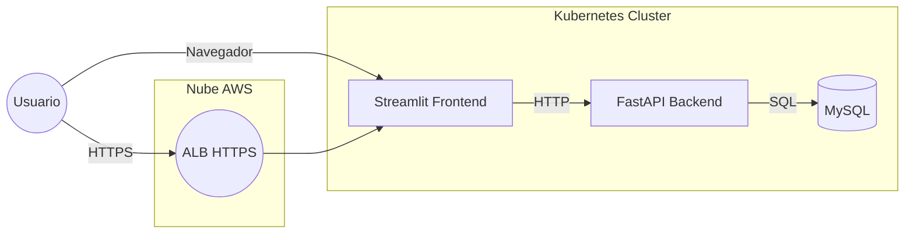
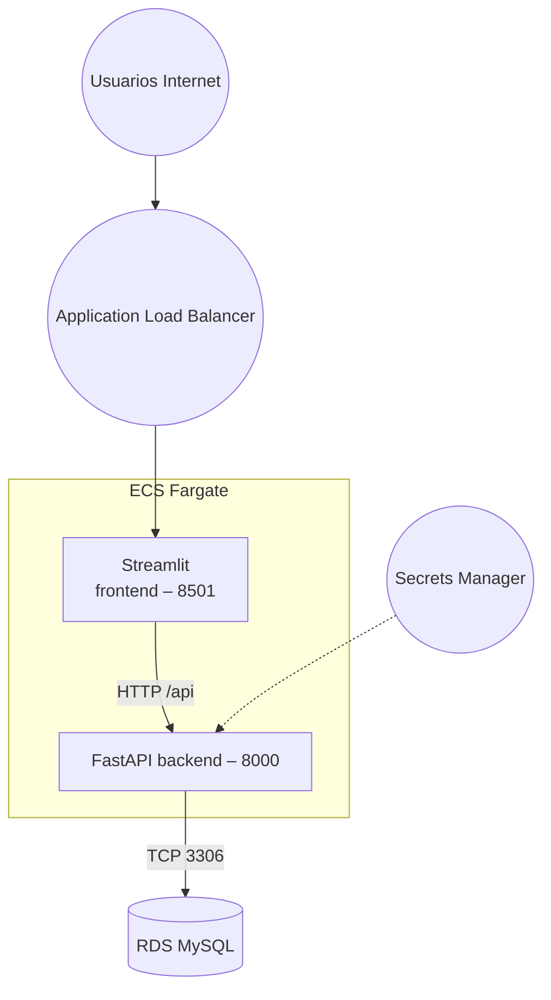

# Zero-Shot Text Classifier – Backend, Frontend & Kubernetes

Proyecto completo que ofrece un servicio de *zero-shot text classification* basado en **Hugging Face Transformers**, expuesto mediante **FastAPI**, con un frontend en **Streamlit**, persistencia en **MySQL** y orquestación con **Kubernetes** (desarrollo en Minikube y producción en AWS EKS). Incluye contenedores Docker, manifiestos K8s y pipeline CI/CD.

---
## Tabla de contenidos
1. [Arquitectura](#arquitectura)
2. [Estructura del repositorio](#estructura-del-repositorio)
3. [Requisitos](#requisitos)
4. [Puesta en marcha local](#puesta-en-marcha-local)
5. [Despliegue en Minikube](#despliegue-en-minikube)
6. [Despliegue en AWS ECS Fargate](#despliegue-en-aws-ecs-fargate)
7. [Despliegue en AWS EKS](#despliegue-en-aws-eks)
8. [CI/CD con GitHub Actions](#cicd-con-github-actions)
9. [Variables de entorno](#variables-de-entorno)
10. [Mantenimiento y escalabilidad](#mantenimiento-y-escalabilidad)
11. [Licencia](#licencia)

---
## Arquitectura



* **Backend**: FastAPI + pipeline HF *zero-shot-classification* (modelo mDeBERTa-v3).
* **Frontend**: Streamlit llama al backend (`/classify`, `/stats`).
* **MySQL**: Guarda cada predicción y permite estadísticas.
* **Kubernetes**: Deployments, Services, HPA, Secret/Config, Ingress ALB.
* **Docker**: Contenedores separados para backend y frontend con dependencias declaradas.
* **CI/CD**: GitHub Actions construye, publica en ECR y hace rollout a EKS.

---
## Estructura del repositorio

```
│  README.md
│  docker-compose.yml           # Dev rápido local
│  .env                         # Ejemplos de vars (NUNCA subas secretos reales)
├─app/                          # Backend FastAPI
│   ├─main.py
│   ├─requirements.txt
│   └─Dockerfile
├─frontend/                     # Streamlit UI
│   ├─app.py
│   ├─requirements.txt
│   └─Dockerfile
├─k8s/                          # Manifiestos para Minikube
│   ├─backend-deploy.yaml
│   ├─frontend-deploy.yaml
│   ├─mysql.yaml
│   └─secret.yaml
└─aws/                          # Archivos extra para AWS Canvas
    ├─service-account.yaml
    ├─external-secret.yaml
    └─ingress.yaml
```

---
## Requisitos

* Docker 20+
* Docker Compose v2
* Python 3.9+ (para uso fuera de contenedores)
* Kubernetes (≥ 1.24) – Minikube para pruebas locales o Amazon EKS en producción.
* AWS CLI, `eksctl`, `kubectl`, `helm` (para despliegue en AWS).

---
## Puesta en marcha local

1. Copia `.env.example` → `.env` y ajusta credenciales.
2. Levanta con Docker Compose:
   ```bash
   docker compose up --build
   ```
3. Frontend disponible en <http://localhost:8501>.

---
## Despliegue en Minikube

```bash
# Habilitar Docker de Minikube y construir imgs locales
minikube start --memory 6144 --cpus 4
eval $(minikube -p minikube docker-env)

docker build -t zeroshot-backend:latest ./app
docker build -t zeroshot-frontend:latest ./frontend

kubectl apply -f k8s/

minikube service zeroshot-frontend   # abre el navegador
```

> Problemas habituales:
> * **ImagePullBackOff** → Olvidaste construir o etiquetar imágenes dentro del daemon de Minikube.
> * **Read timed out** → Incrementa CPU del backend o `timeout` en frontend.

---

## Despliegue en AWS ECS Fargate

La carpeta `aws/` incluye la plantilla `cloudformation3.yaml` que define **toda** la infraestructura necesaria para ejecutar el clasificador en AWS utilizando contenedores **Fargate** (server-less), base de datos **RDS MySQL**, balanceador **ALB** y registros en **CloudWatch**.

### 1. Arquitectura



1. **VPC pública** con dos subredes (`10.0.1.0/24`, `10.0.2.0/24`) y gateway a Internet.
2. **Security Groups**:
   * `ALBSecurityGroup` abre 80/443 a Internet.
   * `FargateSecurityGroup` permite 8000/8501 *solo* desde el ALB.
   * `DBSecurityGroup` permite 3306 desde las tareas Fargate.
3. **ALB** escucha en :80; regla por defecto → Frontend.  Regla con `path-pattern /api*` → Backend.
4. **Target Groups** con health-checks:
   * BackendTG → `/healthz` en 8000.
   * FrontendTG → `/_stcore/health` en 8501.
5. **ECS Cluster + Task Definitions**
   * `BackendTask` (FastAPI, 1 vCPU / 2 GiB, imagen parametrizada `ImageBackend`).
   * `FrontendTask` (Streamlit, 0.5 vCPU / 1 GiB, imagen `ImageFrontend`).
6. **ECS Services** mantienen 1 tarea viva de cada tipo y las asocian al ALB.
7. **RDS MySQL** `db.t3.micro`, 20 GiB, `DBName=zeroshot`.
8. **Secrets Manager** almacena contraseña de MySQL y se expone a backend vía variables.
9. **CloudWatch Logs** agrupa logs de ambas tareas.

### 2. Parámetros clave

| Parámetro | Descripción | Default |
|-----------|-------------|---------|
| `EnvName` | Prefijo para recursos | `dev` |
| `ImageBackend` | URI de la imagen FastAPI en ECR | `:0.1.2` |
| `ImageFrontend` | URI imagen Streamlit | `:0.1.3` |
| `DBUsername` | Usuario MySQL | `appuser` |
| `VpcCidr` etc. | Rangos CIDR | |

### 3. Build & Push de imágenes

```bash
# Backend
cd app
docker build -t zeroshot-backend:0.1.4 .
aws ecr get-login-password --region us-east-1 | \
  docker login --username AWS --password-stdin 571600866805.dkr.ecr.us-east-1.amazonaws.com

docker tag zeroshot-backend:0.1.4 \
  571600866805.dkr.ecr.us-east-1.amazonaws.com/zeroshot-backend:0.1.4

docker push 571600866805.dkr.ecr.us-east-1.amazonaws.com/zeroshot-backend:0.1.4

# Frontend
cd ../frontend
docker build -t zeroshot-frontend:0.1.4 .
... (tag & push igual)
```

### 4. Despliegue de la pila

```bash
aws cloudformation deploy \
  --stack-name zeroshot-stack \
  --template-file aws/cloudformation.yaml \
  --parameter-overrides ImageBackend=571600866805.dkr.ecr.us-east-1.amazonaws.com/zeroshot-backend:0.1.4 \
                       ImageFrontend=571600866805.dkr.ecr.us-east-1.amazonaws.com/zeroshot-frontend:0.1.4 \
  --capabilities CAPABILITY_NAMED_IAM
```

Al terminar, obtén la URL:

```bash
aws cloudformation describe-stacks --stack-name zeroshot-stack \
  --query "Stacks[0].Outputs[?OutputKey=='ALBURL'].OutputValue" --output text
```

Abre esa URL en tu navegador para usar la app; `/api/healthz` debe responder `{"status":"ok"}`.

### 5. Actualizaciones

* **Solo código**: build + push nueva etiqueta y `update-service --force-new-deployment`.
* **Cambios infra**: actualiza la plantilla y ejecuta de nuevo `cloudformation deploy`.

### 6. Eliminación

```bash
aws cloudformation delete-stack --stack-name zeroshot-stack
```

---
## Despliegue en AWS EKS

1. **Crear clúster** (ejemplo):
   ```bash
   eksctl create cluster --name zeroshot-cluster --region us-east-1 --managed --node-type t3.large --nodes 2
   ```
2. **Instalar complementos**: Load Balancer Controller, External-Secrets Operator.
3. **Subir imágenes a ECR** y actualiza tags en `k8s/*`.
4. **Crear secreto en Secrets Manager** (`zeroshot/db`).
5. **Aplicar manifiestos AWS**:
   ```bash
   kubectl apply -f aws/
   kubectl apply -f k8s/
   ```
6. Crea un registro DNS (`CNAME`) apuntando al hostname del ALB.

Guía detallada en la sección Anexos del Wiki.

---
## CI/CD con GitHub Actions

* Workflow: `.github/workflows/deploy.yml` (ejemplo incluido en la documentación).
* Pasos principales:
  1. Login a ECR via OIDC.
  2. `docker buildx` para backend y frontend.
  3. Push a ECR con tag `GITHUB_SHA`.
  4. Actualiza manifests vía Kustomize.
  5. `kubectl apply` y `rollout status`.

Secrets necesarios en GitHub: `AWS_ROLE`, `AWS_REGION`, `ECR_REPO_BACKEND`, `ECR_REPO_FRONTEND`.

---
## Variables de entorno

| Variable | Descripción | Ejemplo |
|----------|-------------|---------|
| `DB_HOST` | Host MySQL | `mysql` (Minikube) / RDS endpoint |
| `DB_PORT` | Puerto MySQL | `3306` |
| `DB_USER` / `DB_PASSWORD` | Credenciales de app |  |
| `DB_NAME` | Nombre BD | `zeroshot` |
| `API_URL` (frontend) | URL del backend | `http://zeroshot-backend:8000` |
| `MODEL_NAME` (build-arg) | Modelo HF | `MoritzLaurer/mDeBERTa-v3-base-xnli-multilingual-nli-2mil7` |

Las credenciales en producción se almacenan en Secrets Manager y se inyectan vía `ExternalSecret`.

---
## Mantenimiento y escalabilidad

* **HPA** ajusta réplicas del backend en función de CPU.
* **Container Insights** + CloudWatch para métricas y logs.
* **RDS Multi-AZ** para alta disponibilidad.
* **ALB + ACM** para terminación TLS y WAF opcional.
* **Quantization/GPU**: si el modelo se vuelve muy pesado, usa GPU nodes o quantiza con ONNX.

