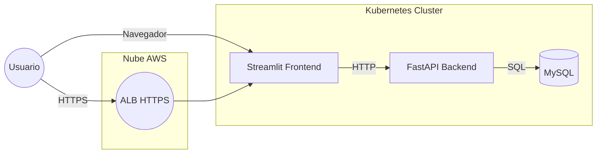

# Zero-Shot Text Classifier – Backend, Frontend & Kubernetes

Proyecto completo que ofrece un servicio de *zero-shot text classification* basado en **Hugging Face Transformers**, expuesto mediante **FastAPI**, con un frontend en **Streamlit**, persistencia en **MySQL** y orquestación con **Kubernetes** (desarrollo en Minikube y producción en AWS EKS). Incluye contenedores Docker, manifiestos K8s y pipeline CI/CD.

---
## Tabla de contenidos
1. [Arquitectura](#arquitectura)
2. [Estructura del repositorio](#estructura-del-repositorio)
3. [Requisitos](#requisitos)
4. [Puesta en marcha local](#puesta-en-marcha-local)
5. [Despliegue en Minikube](#despliegue-en-minikube)
6. [Despliegue en AWS EKS](#despliegue-en-aws-eks)
7. [CI/CD con GitHub Actions](#cicd-con-github-actions)
8. [Variables de entorno](#variables-de-entorno)
9. [Mantenimiento y escalabilidad](#mantenimiento-y-escalabilidad)
10. [Licencia](#licencia)

---
## Arquitectura



* **Backend**: FastAPI + pipeline HF *zero-shot-classification* (modelo mDeBERTa-v3).
* **Frontend**: Streamlit llama al backend (`/classify`, `/stats`).
* **MySQL**: Guarda cada predicción y permite estadísticas.
* **Kubernetes**: Deployments, Services, HPA, Secret/Config, Ingress ALB.
* **Docker**: Contenedores separados para backend y frontend con dependencias declaradas.
* **CI/CD**: GitHub Actions construye, publica en ECR y hace rollout a EKS.

---
## Estructura del repositorio

```
│  README.md
│  docker-compose.yml           # Dev rápido local
│  .env                         # Ejemplos de vars (NUNCA subas secretos reales)
├─app/                          # Backend FastAPI
│   ├─main.py
│   ├─requirements.txt
│   └─Dockerfile
├─frontend/                     # Streamlit UI
│   ├─app.py
│   ├─requirements.txt
│   └─Dockerfile
├─k8s/                          # Manifiestos para Minikube
│   ├─backend-deploy.yaml
│   ├─frontend-deploy.yaml
│   ├─mysql.yaml
│   └─secret.yaml
└─aws/                          # Archivos extra para AWS Canvas
    ├─service-account.yaml
    ├─external-secret.yaml
    └─ingress.yaml
```

---
## Requisitos

* Docker 20+
* Docker Compose v2
* Python 3.9+ (para uso fuera de contenedores)
* Kubernetes (≥ 1.24) – Minikube para pruebas locales o Amazon EKS en producción.
* AWS CLI, `eksctl`, `kubectl`, `helm` (para despliegue en AWS).

---
## Puesta en marcha local

1. Copia `.env.example` → `.env` y ajusta credenciales.
2. Levanta con Docker Compose:
   ```bash
   docker compose up --build
   ```
3. Frontend disponible en <http://localhost:8501>.

---
## Despliegue en Minikube

```bash
# Habilitar Docker de Minikube y construir imgs locales
minikube start --memory 6144 --cpus 4
eval $(minikube -p minikube docker-env)

docker build -t zeroshot-backend:latest ./app
docker build -t zeroshot-frontend:latest ./frontend

kubectl apply -f k8s/

minikube service zeroshot-frontend   # abre el navegador
```

> Problemas habituales:
> * **ImagePullBackOff** → Olvidaste construir o etiquetar imágenes dentro del daemon de Minikube.
> * **Read timed out** → Incrementa CPU del backend o `timeout` en frontend.

---
## Despliegue en AWS EKS

1. **Crear clúster** (ejemplo):
   ```bash
   eksctl create cluster --name zeroshot-cluster --region us-east-1 --managed --node-type t3.large --nodes 2
   ```
2. **Instalar complementos**: Load Balancer Controller, External-Secrets Operator.
3. **Subir imágenes a ECR** y actualiza tags en `k8s/*`.
4. **Crear secreto en Secrets Manager** (`zeroshot/db`).
5. **Aplicar manifiestos AWS**:
   ```bash
   kubectl apply -f aws/
   kubectl apply -f k8s/
   ```
6. Crea un registro DNS (`CNAME`) apuntando al hostname del ALB.

Guía detallada en la sección Anexos del Wiki.

---
## CI/CD con GitHub Actions

* Workflow: `.github/workflows/deploy.yml` (ejemplo incluido en la documentación).
* Pasos principales:
  1. Login a ECR via OIDC.
  2. `docker buildx` para backend y frontend.
  3. Push a ECR con tag `GITHUB_SHA`.
  4. Actualiza manifests vía Kustomize.
  5. `kubectl apply` y `rollout status`.

Secrets necesarios en GitHub: `AWS_ROLE`, `AWS_REGION`, `ECR_REPO_BACKEND`, `ECR_REPO_FRONTEND`.

---
## Variables de entorno

| Variable | Descripción | Ejemplo |
|----------|-------------|---------|
| `DB_HOST` | Host MySQL | `mysql` (Minikube) / RDS endpoint |
| `DB_PORT` | Puerto MySQL | `3306` |
| `DB_USER` / `DB_PASSWORD` | Credenciales de app |  |
| `DB_NAME` | Nombre BD | `zeroshot` |
| `API_URL` (frontend) | URL del backend | `http://zeroshot-backend:8000` |
| `MODEL_NAME` (build-arg) | Modelo HF | `MoritzLaurer/mDeBERTa-v3-base-xnli-multilingual-nli-2mil7` |

Las credenciales en producción se almacenan en Secrets Manager y se inyectan vía `ExternalSecret`.

---
## Mantenimiento y escalabilidad

* **HPA** ajusta réplicas del backend en función de CPU.
* **Container Insights** + CloudWatch para métricas y logs.
* **RDS Multi-AZ** para alta disponibilidad.
* **ALB + ACM** para terminación TLS y WAF opcional.
* **Quantization/GPU**: si el modelo se vuelve muy pesado, usa GPU nodes o quantiza con ONNX.

---
## Licencia

Proyecto distribuido bajo la licencia MIT (ver `LICENSE`).
